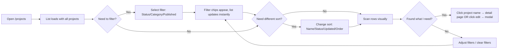
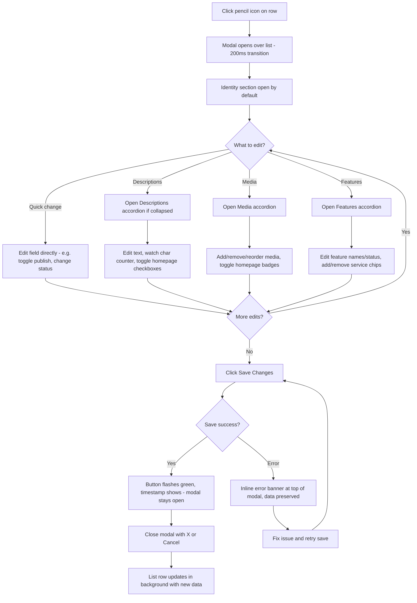
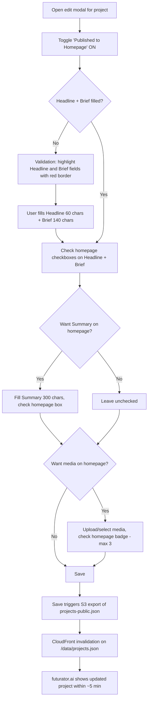
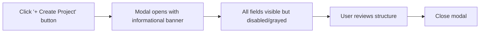
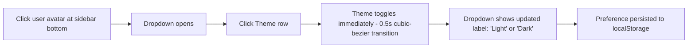

# Futurator-Admin UX Design Specification

_Created on 2026-04-06 by Richie_
_Generated using BMad Method - Create UX Design Workflow v1.0_

---

## Executive Summary

The Futurator Admin Hub is a centralised cost observatory and control plane for the Futurator portfolio — 9+ AI-powered applications running on AWS with dependencies on Google Cloud and third-party API providers (Anthropic, ElevenLabs, OpenAI, etc.).

**UX Design Scope:** This specification covers a comprehensive visual overhaul aligning the admin hub with the futurator.ai public site's design language, plus a complete redesign of the `/projects` page into a Project Hub with list view, edit modals, multi-description system, media management, and publish controls.

**Key Design Goals:**

- Unify the visual identity across futurator.ai and admin.futurator.ai
- Introduce dark/light theme with dark-first design (matching public site)
- Transform the projects page from a read-only gallery to an actionable hub
- Enable project content management for the public homepage
- Provide a fast, modal-based editing experience for project data

**Target User:** Richie — sole operator, intermediate technical skill level, managing a complex multi-project portfolio. Desktop-primary usage with tablet responsiveness.

**Core Experience:** Open the dashboard and instantly see portfolio health. Navigate to projects, scan the full list, click edit, update in a modal, save. Toggle which projects appear on futurator.ai. All in under 30 seconds per project.

**Desired Emotional Response:** Empowered and in control — the feeling of having total clarity over a complex portfolio, with a premium interface that matches the sophistication of the projects being managed.

**Platform:** Web (desktop-primary, responsive to tablet). No mobile-specific requirements — admin tool used at a workstation.

**Inspiration Sources:**

- **futurator.ai** — The primary visual reference. Dark-first aesthetic, Geist typography at ultralight weights, sky-blue (#8fc9ff) and purple (#a78bfa) accents, glassmorphic elements, generous whitespace.
- **Vercel Dashboard** — Admin panel that shares the Geist font and dark-mode-first approach. Dense data, elegant presentation.
- **Linear** — Fast keyboard-driven project management with excellent list views and modal editing.

**UX Complexity Assessment:** Medium. Standard CRUD patterns (list, filter, edit modal) with some custom components (multi-description editor with character counters, media manager with homepage toggles, chip-input for service tags). No novel interaction patterns — all established UX conventions applied to a specific domain.

---

## 1. Design System Foundation

### 1.1 Design System Choice

**Selected:** shadcn/ui (Radix UI + Tailwind CSS 4) — retained from current implementation.

**Rationale:** Both futurator.ai and admin.futurator.ai already use the same component stack (Radix primitives, CVA variants, Tailwind CSS 4 with OKLCH tokens). No migration needed — the design system unification is a theme-level change, not a component-level change.

**What Changes:**

- Port futurator.ai OKLCH color tokens into admin hub `globals.css`
- Add dark mode variable set (already defined in futurator public site)
- Add `next-themes` ThemeProvider for light/dark toggle
- Align accent colors to sky-blue (#8fc9ff) and purple (#a78bfa)
- Adopt Geist font at ultralight (200) and light (300) weights for headings
- Adjust border-radius base to 0.625rem (10px) to match public site

**What Stays:**

- All 40+ existing shadcn/ui components (Button, Card, Badge, Dialog, etc.)
- Recharts for data visualization
- Zustand + TanStack React Query for state
- CVA for component variants

**Version Alignment:**

- Tailwind CSS: 4.x (both projects)
- Radix UI: Latest (both projects)
- next-themes: Add to admin hub (already in public site)

---

## 2. Core User Experience

### 2.1 Defining Experience

**One-sentence pitch:** "It's the control panel where you see all your projects, their costs, and what's live — and update anything in a modal without leaving the page."

**Primary user action (repeated):** Scan the project list, click edit, update fields, save. Toggle homepage publish state.

**What must be effortless:**

- Scanning project status across the full portfolio (list density)
- Opening and saving edits (modal speed — open in <200ms, save with confirmation)
- Seeing which projects are published to futurator.ai (visual indicator at a glance)

**Standard UX Patterns Applied:**

- **List view with filters/sort** — established admin table pattern (Linear, Vercel, AWS Console)
- **Modal editing** — medium-large dialog with sectioned form (GitHub settings, Notion properties)
- **Chip inputs** — tag-style multi-select with autocomplete (Gmail labels, GitHub labels)
- **Toggle switches** — boolean publish state (any CMS publish toggle)
- **Character counters** — live count with limit indicator (Twitter/X compose, Shopify SEO)

### 2.2 Novel UX Patterns

No novel UX patterns required. All interactions map to well-established admin panel conventions. The innovation is in the data model (multi-description with per-field homepage flags, media with publish toggles), not in the interaction design.

### 2.3 Core Experience Principles

**Speed:** Every action should feel instant. Modal opens in <200ms. Save completes in <1s. List filters apply immediately (client-side with 11 projects). No loading spinners for navigation — skeleton states only for initial data fetch.

**Guidance:** Minimal — this is a single-user admin tool for an intermediate user. No onboarding, no tooltips by default. Character counters and inline validation provide just-in-time guidance. Empty states give clear CTAs.

**Flexibility:** High control, low complexity. All fields editable in one modal. Collapsible sections let the user focus on what they need. Power features (AI context auto-generate, media reorder) are available but not forced.

**Feedback:** Subtle and precise. Save confirmation is a brief green flash + timestamp, not a toast. Validation errors appear inline next to the field. Published state is a visual dot, not a banner. The UI respects the user's attention.

---

## 3. Visual Foundation

### 3.1 Color System

**Approach:** Inherit futurator.ai's OKLCH color tokens directly. Dark-first design with full light mode support via `next-themes`.

**Semantic Color Map:**

| Role             | Dark Mode                   | Light Mode                  | Usage                      |
| ---------------- | --------------------------- | --------------------------- | -------------------------- |
| Background       | `oklch(0.145 0 0)` #252525  | `oklch(1 0 0)` #FFFFFF      | Page bg                    |
| Surface          | `oklch(0.205 0 0)` #353535  | `oklch(0.985 0 0)` #FAFAFA  | Cards, modals, sidebar     |
| Surface Elevated | `oklch(0.269 0 0)` #454545  | `oklch(0.97 0 0)` #F7F7F7   | Hovers, dropdowns          |
| Text Primary     | `oklch(0.985 0 0)` #FAFAFA  | `oklch(0.145 0 0)` #252525  | Headings, body             |
| Text Muted       | `oklch(0.708 0 0)` #B3B3B3  | `oklch(0.556 0 0)` #8D8D8D  | Labels, secondary          |
| Border           | `oklch(0.269 0 0)` #454545  | `oklch(0.922 0 0)` #EBEBEB  | Dividers, inputs           |
| Accent Primary   | #8fc9ff                     | #3b82f6                     | Active, links, toggles     |
| Accent Secondary | #a78bfa                     | #7c3aed                     | Sidebar active, highlights |
| Success          | #34d399                     | #059669                     | Save, active status        |
| Warning          | #fbbf24                     | #d97706                     | Budget, caution            |
| Destructive      | `oklch(0.637 0.237 25.331)` | `oklch(0.577 0.245 27.325)` | Delete, errors             |
| Published        | #34d399                     | #059669                     | Homepage published dot     |
| Unpublished      | `oklch(0.556 0 0)`          | `oklch(0.708 0 0)`          | Not published dot          |

**Chart Colors (Data Visualization):**

| Token   | Dark                         | Light                       | Usage          |
| ------- | ---------------------------- | --------------------------- | -------------- |
| chart-1 | `oklch(0.488 0.243 264.376)` | `oklch(0.646 0.222 41.116)` | Primary series |
| chart-2 | `oklch(0.696 0.17 162.48)`   | `oklch(0.6 0.118 184.704)`  | Secondary      |
| chart-3 | `oklch(0.769 0.188 70.08)`   | `oklch(0.398 0.07 227.392)` | Tertiary       |
| chart-4 | `oklch(0.627 0.265 303.9)`   | `oklch(0.828 0.189 84.429)` | Quaternary     |
| chart-5 | `oklch(0.645 0.246 16.439)`  | `oklch(0.769 0.188 70.08)`  | Quinary        |

### 3.2 Typography

**Font Family:** Geist (sans-serif), Geist Mono (monospace) — same as futurator.ai.

| Element           | Weight   | Size                     | Letter-spacing | Line-height |
| ----------------- | -------- | ------------------------ | -------------- | ----------- |
| Page title        | 200      | `clamp(24px, 3vw, 32px)` | 0.1em          | 1.2         |
| Section heading   | 300      | 18px                     | 0.05em         | 1.3         |
| Body / inputs     | 400      | 14px                     | normal         | 1.5         |
| Labels / captions | 400      | 12px                     | 0.02em         | 1.4         |
| Monospace / data  | Mono 400 | 13px                     | normal         | 1.5         |
| Status badges     | 500      | 11px                     | 0.05em         | 1.0         |
| Modal title       | 200      | 20px                     | 0.08em         | 1.3         |

### 3.3 Spacing & Layout

**Base unit:** 4px
**Scale:** 4, 8, 12, 16, 24, 32, 48, 64px
**Border-radius base:** 0.625rem (10px) — matches futurator.ai
**Radius variants:** sm=6px, md=8px, lg=10px, xl=14px

### 3.4 Effects

| Effect              | Value                                         | Usage                          |
| ------------------- | --------------------------------------------- | ------------------------------ |
| Glassmorphic blur   | `backdrop-filter: blur(8px)`                  | Modal overlays, dropdowns      |
| Active glow         | `box-shadow: 0 0 40px rgba(143,201,255,0.15)` | Selected/active row            |
| Transition standard | `0.3s ease`                                   | Hovers, toggles                |
| Transition smooth   | `0.5s cubic-bezier(0.4, 0, 0.2, 1)`           | Modal open/close, theme switch |
| Opacity muted       | 0.5                                           | Disabled elements              |
| Opacity hint        | 0.25                                          | Placeholder text               |

**Interactive Visualizations:**

- Color Theme Explorer: [ux-color-themes.html](./ux-color-themes.html)

---

## 4. Design Direction

### 4.1 Chosen Design Approach

**Direction:** Futurator-aligned dark-first admin shell with elegant density.

**Layout Decisions:**

- **Navigation:** Left sidebar (220px) with icon+label items, active state uses left accent border + blue tint
- **Content:** Single main content area, full-width within available space
- **Density:** Balanced — scannable list rows with breathing room, not cramped
- **Content organization:** Table-style list rows (not cards) for project list

**Hierarchy Decisions:**

- **Visual density:** Balanced — clear rows with truncated briefs, status badges, and published dots
- **Header emphasis:** Ultralight (200 weight) page titles with letter-spacing 0.1em
- **Content focus:** Data-driven (status badges, service chips, published indicators)

**Interaction Decisions:**

- **Primary action:** Modal dialog for editing (medium-large, 800px, stays open after save)
- **Information disclosure:** Collapsible accordion sections within modal
- **User control:** High — all fields visible, sections open/close independently

**Visual Style Decisions:**

- **Weight:** Balanced — subtle borders, clear surface hierarchy (bg → surface → elevated)
- **Depth cues:** Subtle elevation via background shade + border, glassmorphic blur on modal overlay
- **Border style:** Subtle 1px solid, slightly lighter than surface

**Header/Navigation Changes:**

- Remove top-right "Ricardo Araya / Sign out" text links
- Add user section at sidebar bottom: avatar (initials) + name + email + chevron
- Click reveals dropdown: Theme toggle (Light/Dark), Settings, Sign out
- Theme toggle switches between dark-first OKLCH tokens and light mode set

**Interactive Mockups:**

- Design Direction Showcase: [ux-design-directions.html](./ux-design-directions.html)
  - Panel 1: Full admin shell with sidebar, list view, filter bar
  - Panel 2: Project list close-up with selected row state
  - Panel 3: Complete edit modal with all accordion sections
  - Panel 4: User dropdown (closed and open states)

---

## 5. User Journey Flows

### 5.1 Critical User Paths

Four critical journeys identified for the Project Hub scope:

---

#### Journey 1: Scan & Triage Projects

**User Goal:** Quickly assess portfolio status — which projects need attention, what's published, what's in what state.

**Approach:** Single-screen scan (no navigation required)

**Flow:**



**Screen States:**

- **Loading:** Skeleton rows (6 rows, same grid layout as data rows)
- **Empty (filtered):** "No projects match your filters" + clear filters button
- **Default:** All projects, sorted by name A-Z
- **Filtered:** Active filter chips below filter bar, count updates: "Projects (4 of 11)"

**Key Decision:** Filtering is client-side (only 11 projects). Instant, no loading state needed for filter changes.

---

#### Journey 2: Edit a Project

**User Goal:** Update project metadata — descriptions, status, services, media, publish state.

**Approach:** Modal dialog (no navigation away from list)

**Flow:**



**Screen States:**

- **Clean:** Save button disabled (no changes)
- **Dirty:** Save button enabled (changes detected)
- **Saving:** Save button shows spinner, disabled
- **Saved:** Brief green flash on button, "Saved at 14:32" timestamp
- **Error:** Red banner at modal top: "Failed to save. [error detail]. Your changes are preserved."
- **Unsaved close:** Confirmation dialog: "You have unsaved changes. Discard?"

**Key Decision:** Modal stays open after save. User closes when done. This supports multi-edit workflows (update descriptions, save, then update media, save again).

---

#### Journey 3: Publish a Project to Homepage

**User Goal:** Make a project visible on futurator.ai with curated descriptions and media.

**Approach:** Part of the edit modal flow (not a separate journey)

**Flow:**



**Validation Rules:**

- If `publishedToHomepage: true`, `headline` must be non-empty and homepage-flagged
- If `publishedToHomepage: true`, `brief` must be non-empty and homepage-flagged
- Max 3 media items with `showOnHomepage: true`
- Validation shown inline — red border on offending fields + helper text

---

#### Journey 4: Create a Project (Informational Placeholder)

**User Goal:** Understand the project creation structure for future use.

**Approach:** Disabled modal with informational banner

**Flow:**



**Banner Text:** "Project creation requires infrastructure provisioning, cost tracking setup, and service registration. This capability is coming in a future update."

**Key Decision:** Button exists to communicate intent and structure. No backend wiring yet. Full creation flow is a separate session scope.

---

#### Journey 5: Switch Theme

**User Goal:** Toggle between dark and light mode.

**Flow:**



**Key Decision:** Theme preference stored in `localStorage` via `next-themes`. Survives page reloads. Dark is the default for new sessions.

---

## 6. Component Library

### 6.1 Component Strategy

**Base:** shadcn/ui (40+ existing components). Most UI needs are covered. Custom components needed only for Project Hub-specific patterns.

### 6.2 Existing Components (Use As-Is with Re-themed Tokens)

| Component    | Usage                                    | Customization                                              |
| ------------ | ---------------------------------------- | ---------------------------------------------------------- |
| Button       | Save, Cancel, Create, Add                | Re-skin with accent-blue primary, add icon variants        |
| Dialog       | Edit modal shell                         | Set max-width 800px, max-height 85vh, glassmorphic overlay |
| Badge        | Status badges, service chips             | Custom color variants: status-active, status-beta, etc.    |
| Select       | Status/Category dropdowns, Sort, Filters | Dark background inputs with OKLCH tokens                   |
| Input        | Text inputs in modal                     | Focus ring using accent-blue                               |
| Switch       | Published toggle                         | Accent-blue when on                                        |
| Skeleton     | Loading states                           | Match row grid layout                                      |
| DropdownMenu | User dropdown at sidebar bottom          | Theme item, Settings, Sign out                             |
| Avatar       | User initials in sidebar                 | Purple accent border                                       |
| Tooltip      | Hover hints on truncated text            | Subtle, dark surface                                       |
| AlertDialog  | Unsaved changes confirmation             | "Discard unsaved changes?"                                 |
| Separator    | Section dividers                         | Subtle border color                                        |

### 6.3 Custom Components (New)

#### ProjectListRow

**Purpose:** Single dense row in the project table.
**Anatomy:** Thumbnail strip (3 max) | Name (link) | Status badge | Category label | Brief (truncated) | Published dot | Edit button
**States:** Default, Hover (elevated background), Selected (blue left border + tint)
**Variants:** None — single layout.
**Accessibility:** Row is keyboard-focusable. Enter on row → navigate to detail. Tab to edit button. Edit button has aria-label "Edit [project name]".

#### ProjectEditModal

**Purpose:** Medium-large dialog with accordion sections for editing all project fields.
**Anatomy:** Header (title + close) | Scrollable body with accordion sections | Footer (save status + Cancel/Save)
**States:** Clean (save disabled), Dirty (save enabled), Saving (spinner), Saved (green flash + timestamp), Error (red banner)
**Behavior:** Opens from edit button click. Stays open after save. Escape or close button to dismiss. Unsaved changes trigger confirmation.

#### DescriptionField

**Purpose:** Text input/textarea with live character counter and homepage checkbox.
**Anatomy:** Label | Homepage checkbox + "homepage" hint | Character counter (N/max) | Input/textarea
**States:** Default, Focus (accent-blue ring), Near limit (counter turns warning), Over limit (counter turns error, save blocked)
**Variants:** Single-line (headline, brief) vs multi-line (summary, full, AI context)

#### ChipInput

**Purpose:** Multi-select input with tag-style chips and autocomplete.
**Anatomy:** Container with chips + text input. Each chip has label + remove button.
**States:** Default, Focus (accent-blue border), Autocomplete open (dropdown below)
**Variants:** AWS chips (gold), AI Provider chips (purple), Integration chips (green), Team member chips (default)
**Behavior:** Type to filter suggestions. Enter/click to add. Backspace removes last chip. Free-text allowed for unlisted items.

#### MediaManager

**Purpose:** Grid of media thumbnails with upload, reorder, and homepage toggle.
**Anatomy:** Grid of MediaThumb cards + "Add media" dashed card
**States:** Default, Dragging (opacity 0.5 + placeholder), Upload progress (progress bar overlay)
**Constraints:** Max 6 total. Max 3 with homepage badge. Drag handles for reorder.
**Accessibility:** Keyboard reorder via arrow keys when focused. Upload via file dialog.

#### FeatureEditor

**Purpose:** Editable feature row with status selector and multi-provider chip inputs.
**Anatomy:** Feature name input | Status badge/selector | AWS chips | AI chips | Integration chips | Delete button
**States:** Default, Editing (inputs focused), Confirm delete (inline "Are you sure?" with undo)
**Behavior:** Inline editing — click name to edit. Service chips use ChipInput component with category-specific autocomplete lists.

#### FilterBar

**Purpose:** Horizontal bar with filter dropdowns, active filter chips, and sort selector.
**Anatomy:** Filter selects (Status, Category, Published) | Active filter chips (removable) | Sort dropdown (right-aligned)
**States:** No filters (dropdowns only), Active filters (chips shown, count updates)
**Behavior:** Client-side filtering (instant). Chip × removes that filter. Sort changes re-render list immediately.

#### UserDropdown

**Purpose:** User section at sidebar bottom with expandable dropdown menu.
**Anatomy:** Avatar (initials) + Name + Email + Chevron → Dropdown: Theme toggle, Settings, Separator, Sign out
**States:** Closed (chevron up), Open (chevron down, dropdown visible)
**Behavior:** Click to toggle. Click outside to close. Theme toggle cycles Light/Dark immediately. Sign out requires no confirmation (single-user app).

---

## 7. UX Pattern Decisions

### 7.1 Consistency Rules

These patterns ensure the admin hub behaves consistently across all pages, not just the Project Hub.

**BUTTON HIERARCHY**

| Level       | Style                                       | Usage                                      |
| ----------- | ------------------------------------------- | ------------------------------------------ |
| Primary     | Solid accent-blue bg, dark text, 500 weight | Save, Create, main CTA (one per view)      |
| Secondary   | Transparent, 1px border, muted text         | Cancel, Back, alternative actions          |
| Ghost       | Transparent, no border, muted text          | Edit icons, inline actions, less prominent |
| Destructive | Red text/border on hover only               | Delete feature, remove chip, sign out      |

**FEEDBACK PATTERNS**

| Event             | Pattern          | Detail                                                             |
| ----------------- | ---------------- | ------------------------------------------------------------------ |
| Save success      | Inline timestamp | "Saved at 14:32" in modal footer — no toast, no modal              |
| Save error        | Inline banner    | Red banner at top of modal with error detail, dismissible          |
| Validation error  | Inline per-field | Red border + helper text below field                               |
| Loading (initial) | Skeleton         | Grid-matching skeleton rows for list, card skeletons for dashboard |
| Loading (action)  | Button spinner   | Replace button text with spinner, disable button                   |
| Filter applied    | Instant update   | No loading indicator — client-side filtering is instant            |

**FORM PATTERNS**

| Decision           | Choice                            | Rationale                                                                                          |
| ------------------ | --------------------------------- | -------------------------------------------------------------------------------------------------- |
| Label position     | Above input                       | Standard for admin forms, best for scanning                                                        |
| Required indicator | None                              | All visible fields are implicitly editable; validation catches empty required fields on save       |
| Validation timing  | On save + on blur for char limits | Char counter updates on every keystroke; red border on blur if over limit; full validation on save |
| Error display      | Inline below field                | Red text below offending field: "Headline is required when published"                              |
| Help text          | Placeholder text only             | No tooltips or captions — inputs have descriptive placeholders                                     |

**MODAL PATTERNS**

| Decision | Choice                                                                                                      |
| -------- | ----------------------------------------------------------------------------------------------------------- |
| Size     | Medium-large: 800px wide, 85vh max-height                                                                   |
| Dismiss  | Close button (X), Cancel button, Escape key. NOT click-outside (prevents accidental dismiss during editing) |
| Focus    | Auto-focus first input (Name field) on open                                                                 |
| Stacking | No stacking — only one modal at a time. Confirmation dialog (unsaved changes) replaces modal temporarily    |
| Scroll   | Internal scroll on modal body. Header and footer fixed                                                      |

**NAVIGATION PATTERNS**

| Decision     | Choice                                                                             |
| ------------ | ---------------------------------------------------------------------------------- |
| Active state | Left accent border (2px accent-blue) + blue tint background on sidebar item        |
| Breadcrumbs  | Not used — sidebar provides context, pages are single-level                        |
| Back button  | Browser back works naturally — no custom back button needed                        |
| Deep linking | `/projects` for list, `/projects/[id]` for detail. Modal does not have its own URL |

**EMPTY STATE PATTERNS**

| Context                 | Content                                                                                       |
| ----------------------- | --------------------------------------------------------------------------------------------- |
| No projects (first use) | "No projects yet. Projects will appear here once seeded." — no CTA (creation is future scope) |
| No filter results       | "No projects match your filters." + "Clear filters" ghost button                              |
| No media                | Dashed "Add media" card with + icon                                                           |
| No features             | "No features defined." + "Add Feature" dashed button                                          |
| No team                 | Empty chip input with placeholder "Add member..."                                             |

**CONFIRMATION PATTERNS**

| Action                           | Pattern                                                                           |
| -------------------------------- | --------------------------------------------------------------------------------- |
| Close modal with unsaved changes | AlertDialog: "You have unsaved changes. Discard?" [Keep editing] [Discard]        |
| Delete feature                   | Inline confirmation: feature row replaces with "Remove [name]? [Cancel] [Remove]" |
| Remove media                     | Direct remove (no confirmation — easy to re-add)                                  |
| Remove chip                      | Direct remove (no confirmation)                                                   |
| Sign out                         | Direct (no confirmation — single-user app, no data loss risk)                     |

**NOTIFICATION PATTERNS**

| Decision  | Choice                                                                                                     |
| --------- | ---------------------------------------------------------------------------------------------------------- |
| Placement | No toast notifications. All feedback is inline (modal footer, field-level, banner)                         |
| Rationale | Single-user admin tool. No need for notification stack. Inline feedback is more precise and less intrusive |

**DATE/TIME PATTERNS**

| Decision       | Choice                                                                 |
| -------------- | ---------------------------------------------------------------------- |
| Format         | Relative for recent ("2 hours ago"), absolute for older ("2026-04-04") |
| Timezone       | User local (browser timezone)                                          |
| Save timestamp | "Saved at 14:32" — 24h format, local time                              |
| Pickers        | Not needed in this scope (no date inputs in project editing)           |

**SEARCH PATTERNS**

| Decision       | Choice                                                                                                                                                 |
| -------------- | ------------------------------------------------------------------------------------------------------------------------------------------------------ |
| Project search | Not in scope — 11 projects, filter/sort is sufficient. If portfolio grows beyond 20, add search bar above filter bar with instant client-side matching |

---

## 8. Responsive Design & Accessibility

### 8.1 Responsive Strategy

**Primary:** Desktop (1280px+). **Secondary:** Tablet (768px-1279px). **Not targeted:** Mobile (<768px) — this is an admin tool used at a workstation.

**Breakpoints:**

| Breakpoint       | Width          | Layout Changes                                                                                                                  |
| ---------------- | -------------- | ------------------------------------------------------------------------------------------------------------------------------- |
| Desktop          | >= 1280px      | Full sidebar (220px) + main content. Project list: all 7 columns visible                                                        |
| Tablet landscape | 768px - 1279px | Sidebar collapses to icon-only (56px). Project list: hide Brief column, thumbnails shrink to 2                                  |
| Tablet portrait  | < 768px        | Sidebar hidden (hamburger toggle). Project list: hide Thumbnails + Brief, show Name/Status/Pub/Edit only. Modal goes full-width |

**Adaptation Patterns:**

| Element              | Desktop                       | Tablet                                       |
| -------------------- | ----------------------------- | -------------------------------------------- |
| Sidebar              | Full: icon + label (220px)    | Collapsed: icon only (56px), hover to expand |
| Project list columns | All 7 visible                 | 4-5 columns (hide brief, shrink thumbnails)  |
| Edit modal           | 800px centered                | Full-width with 16px margin                  |
| Filter bar           | Horizontal, all visible       | Wraps to 2 rows if needed                    |
| User dropdown        | Above user section in sidebar | Same behavior                                |
| Page title           | 24-32px clamp                 | Same clamp scales down naturally             |

### 8.2 Accessibility Strategy

**Target:** WCAG 2.1 Level AA — recommended standard for web applications.

**Key Requirements:**

| Requirement         | Implementation                                                                                                                                                           |
| ------------------- | ------------------------------------------------------------------------------------------------------------------------------------------------------------------------ |
| Color contrast      | 4.5:1 minimum for text, 3:1 for large text and UI components. Verified: accent-blue (#8fc9ff) on dark bg (#252525) = 7.8:1. Light mode accent (#3b82f6) on white = 4.6:1 |
| Keyboard navigation | All interactive elements reachable via Tab. Modal traps focus. Escape closes modal/dropdown. Arrow keys for chip navigation and media reorder                            |
| Focus indicators    | 2px accent-blue outline + dim glow on all focusable elements. Never hidden                                                                                               |
| ARIA labels         | Edit buttons: `aria-label="Edit [project name]"`. Toggle: `aria-checked`. Accordion: `aria-expanded`. Modal: `role="dialog" aria-labelledby`                             |
| Screen reader       | Status badges: `aria-label="Status: beta"`. Published dot: `aria-label="Published to homepage" / "Not published"`. Char counters: `aria-live="polite"`                   |
| Touch targets       | Minimum 44x44px for all interactive elements on tablet breakpoint                                                                                                        |
| Reduced motion      | `prefers-reduced-motion: reduce` → disable transition animations, modal appears instantly                                                                                |

**Testing Strategy:**

| Method        | Tool                                                      |
| ------------- | --------------------------------------------------------- |
| Automated     | Lighthouse accessibility audit (target 95+), axe DevTools |
| Manual        | Keyboard-only navigation test through all journeys        |
| Screen reader | VoiceOver (macOS) testing on key flows                    |
| Contrast      | Chrome DevTools contrast checker on all color pairings    |

---

## 9. Implementation Guidance

### 9.1 Completion Summary

**What was designed:**

- **Design System:** shadcn/ui retained, re-themed with futurator.ai OKLCH tokens
- **Visual Foundation:** Dark-first color system with full light mode, Geist typography, 10px radius, glassmorphic modal overlay
- **Design Direction:** Futurator-aligned elegant admin shell — sidebar nav, dense list view, modal editing
- **User Journeys:** 5 flows designed (Scan/Triage, Edit Project, Publish to Homepage, Create Placeholder, Theme Switch)
- **Custom Components:** 8 new components (ProjectListRow, ProjectEditModal, DescriptionField, ChipInput, MediaManager, FeatureEditor, FilterBar, UserDropdown)
- **UX Patterns:** 10 pattern categories decided for cross-app consistency
- **Responsive Strategy:** Desktop-first with tablet adaptation at 768px breakpoint
- **Accessibility:** WCAG 2.1 Level AA compliance target

### 9.2 Implementation Phases (UX Perspective)

| Phase                     | UX Components                                                                                 | Depends On                   |
| ------------------------- | --------------------------------------------------------------------------------------------- | ---------------------------- |
| **Phase 0: Theme**        | Port OKLCH tokens to globals.css, add next-themes ThemeProvider, update Geist typography      | Nothing                      |
| **Phase 1: Shell**        | UserDropdown component, sidebar user section, remove top-right user links                     | Phase 0                      |
| **Phase 2: List View**    | ProjectListRow, FilterBar, skeleton loading states                                            | Phase 0 + data model changes |
| **Phase 3: Edit Modal**   | ProjectEditModal shell, Identity + Descriptions sections, DescriptionField with char counters | Phase 2                      |
| **Phase 4: Rich Editing** | ChipInput, FeatureEditor, MediaManager, Team section                                          | Phase 3                      |
| **Phase 5: Publish Flow** | Homepage toggles on descriptions/media, validation rules, S3 export trigger                   | Phase 3                      |
| **Phase 6: Polish**       | Empty states, error states, keyboard navigation, a11y audit, reduced-motion                   | All phases                   |

### 9.3 Design Tokens to Port

Copy from futurator.ai `globals.css` to admin hub `globals.css`:

```
All --background, --foreground, --card, --primary, --secondary, --muted,
--accent, --border, --input, --ring, --destructive, --sidebar-* tokens
(both light and dark mode sets)

Add custom tokens:
--accent-blue: #8fc9ff (dark) / #3b82f6 (light)
--accent-purple: #a78bfa (dark) / #7c3aed (light)
--success: #34d399 (dark) / #059669 (light)
--warning: #fbbf24 (dark) / #d97706 (light)
--published: var(--success)
--unpublished: var(--muted-foreground)
```

### 9.4 Files to Create/Modify

**New files:**

- `src/components/projects/project-list-row.tsx`
- `src/components/projects/project-edit-modal.tsx`
- `src/components/projects/description-field.tsx`
- `src/components/projects/chip-input.tsx`
- `src/components/projects/media-manager.tsx`
- `src/components/projects/feature-editor.tsx`
- `src/components/projects/filter-bar.tsx`
- `src/components/layout/user-dropdown.tsx`
- `src/components/theme-provider.tsx`

**Modified files:**

- `src/app/globals.css` — OKLCH token overhaul + dark mode
- `src/app/layout.tsx` — Wrap with ThemeProvider
- `src/app/projects/page.tsx` — Rewrite: grid → list view
- `src/components/layout/app-shell.tsx` — Sidebar user section, remove top-right links
- `src/lib/constants.ts` — Service provider lists for autocomplete

---

## Appendix

### Related Documents

- Product Requirements: `docs/PRD.md`
- Enhancement Spec: `docs/concepts/project-hub-enhancement.md`
- Architecture: `docs/architecture.md`

### Core Interactive Deliverables

- **Color Theme Visualizer**: docs/ux-color-themes.html
- **Design Direction Mockups**: docs/ux-design-directions.html

### Version History

| Date       | Version | Changes                         | Author |
| ---------- | ------- | ------------------------------- | ------ |
| 2026-04-06 | 1.0     | Initial UX Design Specification | Richie |

---

_This UX Design Specification was created through collaborative design facilitation, not template generation. All decisions were made with user input and are documented with rationale._
